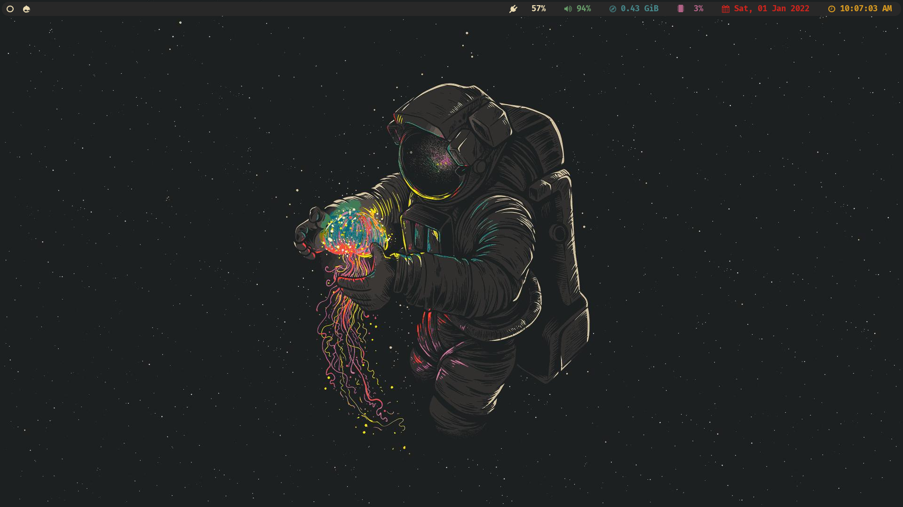
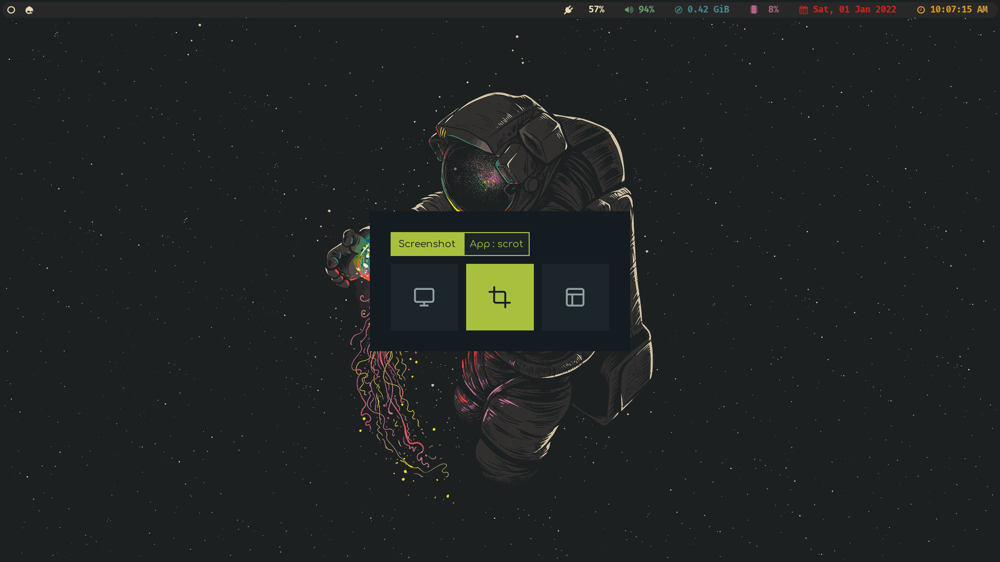

# Arch-i3

### <u>Dependencies:</u>

- <a href=https://i3wm.org/>i3wm</a>

- [Polybar](https://github.com/polybar/polybar)

- [Rofi](https://github.com/davatorium/rofi)

- [fish](https://fishshell.com/)

- [starship](https://starship.rs/)

- [picom](https://github.com/yshui/picom)

- [alacritty](https://github.com/alacritty/alacritty)

- [nitrogen](https://wiki.archlinux.org/title/Nitrogen)

- [paru](https://github.com/Morganamilo/paru)

- [PcManFM](https://github.com/lxde/pcmanfm)

- [Flameshot](https://github.com/flameshot-org/flameshot)

### <u>Installation:</u>

Install the dependencies before cloning the repository

Clone this repo in your .config/ folder

```bash
git clone https://github.com/4r6h/Arch-i3.git
cd Arch-i3
./Arch-i3-install.sh
```




